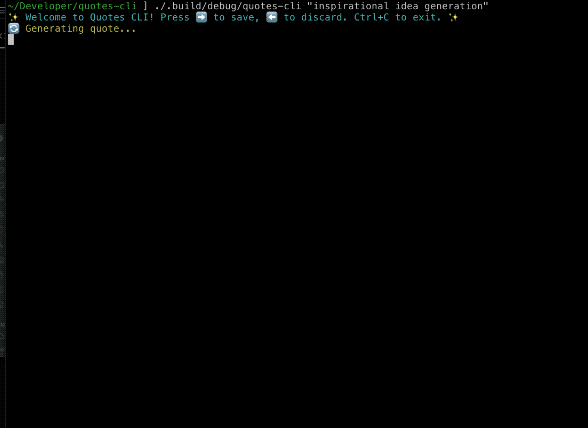

# Quotes CLI

✨ **Welcome to Quotes CLI!** ✨

A simple Swift-based command-line tool that generates short, compelling AI-generated quotes based on an optional theme.



The [spec](spec.md) and [prompt list](prompt_list.md) were generated using ideas from [Harper Reed](https://github.com/harperreed)'s blog post [here](https://harper.blog/2025/02/16/my-llm-codegen-workflow-atm/).

## Features
- **AI-Generated Quotes**: Fetch short quotes from OpenAI’s API, optionally guided by a user-supplied theme.
- **Interactive Controls**: 
  - **Left Arrow**: Discard the current quote and fetch a new one.
  - **Right Arrow**: Save the displayed quote to a local SQLite database for later reference.
  - **Ctrl+C**: Exit the application gracefully.
- **Verbose Mode**: Use the `--verbose` flag to see additional logs, including the prompt sent to OpenAI.
- **ANSI-Styled Output**: Enjoy colorized messages and emoji-based indicators in the terminal.

## Usage
After cloning and building via Swift Package Manager (`swift build`), run the executable from your terminal:

```
USAGE: quotes-command [<theme>] [--verbose]

ARGUMENTS:
  <theme>                 Theme for the quotes

OPTIONS:
  -v, --verbose           Enable verbose logging.
  -h, --help              Show help information.
```

1. **Press Right Arrow (→)** to save a quote to `quotes.db`.
2. **Press Left Arrow (←)** to discard a quote and fetch another.
3. **Press Ctrl+C** to exit at any time.

## Getting Started
1. **Set Up Environment**: Create a `.env` file with your OpenAI API key:
   ```
   OPENAI_API_KEY=your-openai-key
   ```
2. **Build and Run**:
   ```bash
   swift build
   swift run quotes-cli "inspiration" --verbose
   ```
   Omit `"inspiration"` if you want a random theme.

## License
This project is available under the MIT license. Feel free to fork, modify, and share!